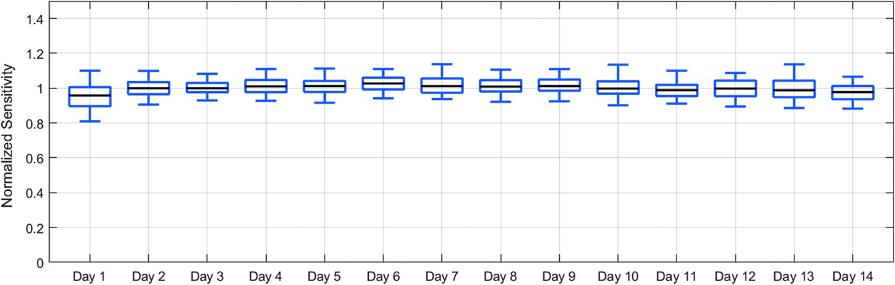
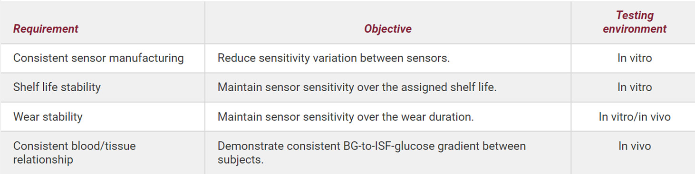

**This readme file have both English and Chinese versions，English version in first half and Chinese in second half.**

**该Readme文件含有英文和汉语双版本，英文版在前，中文版在后**
# calibration_algorithms_for_CGM

 An opensource calibration algorithms for CGM, all the algoritms are recreate from literatures(except for MLP).

### 1. What is a continous glucose monitor and how is it different, compared to traditional glucose meter?
Monitoring blood glucose is of great importance to many people, especially those with diabetes or impaired glucose tolerance. Currently, the main blood glucose monitoring devices (Fig. 1) require a puncture into a blood vessel to extract a tiny sample of blood to test the blood glucose level of that. Typically, multiple pricks are required each day for diabetic patients to test their blood glucose concentration; the process causes multiple distress and suffering to the patient: the pain of multiple pricks, the risk of infection, and the contamination of the sample and distortion of the data due to handling issues. The advent of continous glucose monitor provides a more comfortable and safer solution for diabetics and those with impaired glucose tolerance. Dynamic glucose meters, also known as continuous glucose monitors. The device continuously monitors the body's glucose and records its trend as a basis for diabetes management. Theoretically, there can be many ways to achieve continuous glucose monitoring. However, here, the focus is only on the realization of the electrochemical method. In this method, an electrochemical probe is implanted subcutaneously to continuously monitor glucose in the subcutaneous tissue (Fig. 1); during the monitoring process, pain is mild, foreign body sensation is weak, and blood glucose data can be automatically output for multiple consecutive days (~14 days).

Fig. 1: Left, conventional glucose meter, prick to blood vessel, direct sample from vessel; right, continous glucose monitor, continuous measurement of glucose in subcutaneous tissue fluid.

### 2.How does CGM work and what is the role of CGM algoritms?
The working principle of CGM is as follows (Fig. 2):

1. Once the probe is implanted into the subcutaneous tissue, Glucose oxidase (GOx) immobilized on the probe catalyzes the oxidation of glucos; then through an electron transfer process, electrons are transfered to the electrode to form an electric current; this current is positively correlated with the concentration of glucose (quasi-linear relationship);
2. the circuit board and chip on the CGM device record and process this current, which is ultimately output as an electrical signal;
3. the strength of the electrical signal has a positive correlation with the concentration of glucose in the tissue fluid, which needs to be inverted by an algorithm (calibration algorithm), to get output of the concentration of glucose in the tissue fluid, and even to the concentration of glucose in the bloodstream (Note: the concentration of glucose in the tissue and the concentration of glucose in the bloodstream are also positively correlated).

Fig. 2, Structure of CGM device

### 3. The existing algorithms, their advantages and disadvantages?
| Algorithms | Representative Literature | Advantages and Disadvantages |
| ----------- | ----------- | ----------- |
| 1. Two or mulitiple points linear models | None | This method is simple and stable, but does not account for possible drift of the electrochemical probes and requires periodic recalibration (factory calibration is not possible unless the CGM device is very robust overall)|
|2. Autoregressive models | J Diabetes Sci Technol 2010;4(2):391-403 | This method assumes that blood glucose concentrations at a given point in time are correlated with blood glucose at previous points in time (because they are correlated with "their own priors" rather than with other factors; hence named as autocorrelation model). This method is not stable and the predicted blood glucose concentrations are subject to severe drift and need to be calibrated periodically with blood glucose data. |
|3. Kalman Filter based models for Continuous Glucose Monitoring | The Extended Kalman Filter for Continuous Glucose Monitoring | The Kalman filter model containing blood glucose, tissue glucose, and other parameters (output electrical signal and sensitivity of probe) is created; the blood glucose values are used as the initial inputs for model, and then the algorithm combines the measured electrical signals to continuously output a predicted blood glucose concentration. However many of the parameters of the model cannot be learned directly from the data, and need to be predicted by humans, which is arbitrary.
|4. Qusilinear Regression Models Considering Drift of Probe | Toward Calibration-Free Continuous Glucose Monitoring Sensors: Bayesian Calibration Approach Applied to Next-Generation Dexcom Technology | This type of model takes into account sensor drift and the relationship between blood glucose and tissue fluid glucose, which make the model more robust. And at the same time, factory calibration can be achieved as long as the equipment is robust at some extent.|

Note:
Factory calibration: This concept is distinguished from User calibration, which requires the users measure their blood glucose using blood glucose meter at a specific moment, and then input that data into the CGM to correct the bias/error from the CGM device. In Factory calibration model, additional blood glucose measurement is not required; its equipment and algorithms are well robust and the bias predicted by the CGM device is controllable. User calibration requires the user to take blood glucose measurements from time to time, with poor user compliance and poor user experience; in addition, during blood glucose measurements, if the user is not operating in a standardized manner, the measurements may have a large bias, leading to distortion of the inverse-predicted glucose concentration. Two literatures are presented below to outline the factory calibration:

Literature 1: Modeling the Glucose Sensor Error

Figure 3: The electrical signals collected by 4 CGM devices worn on the same subject have a great deviation (the trend does not vary much from device to device). The main source of bias is that the devices are less consistent with each other. In this case, a common sets of parameters needs to be derived firstly; and then, depending on the specific device, a specific set of parameters applicable to that particular device is got through user calibration. As shown in Toward Calibration-Free Continuous Glucose Monitoring Sensors: Bayesian Calibration Approach Applied to Next-Generation Dexcom Technology.

Literature 2: Factory-Calibrated Continuous Glucose Sensors: The Science Behind the Technology The authors of this literature, from Abbott, present the key technical points of factory calibration

Figure 4: Abbott devices have good consistency: sensitivity consistency (over several batches) and stability (over 14 days). In such case, factory calibration can be achieved with a simpler model [all devices share a (nearly) common set of parameters, eliminating the need for the user to configure a separate set of specific parameters for each device].

Figure 5: Requirements for a GCM device to be able to achieve factory calibration. This includes: device factory consistency, device shelf stability, and stability during wear (all of which depend on, 1] the electrical stability of the device, 2] the design of the electrochemical probes as well as the consistency and stability of the manufacturing of them, 3] the biocompatibility of the device, and 4] the proper wearing and using by the user).

### 4. Description of project elements
**In this project, the CGM device is expected to meet the requirements of Fig. 5. In this case, the inverse results of the "Qusilinear Regression Models Considering Drift of Probe" are sufficiently accurate and do not need to be calibrated for a specific device or a specific patient. However, if the robustness of the device is insufficient, e.g., the hydrogel layer of the electrochemical probe is not effective, this factor can be taken into account when designing the algorithm. Here, the factor was not included in the model due to limited experimental conditions and data acquisition. In the end, as my major on chemistry and biology, it was not too difficult for me to take these factors into account, collect and obtain such data, and add them to the model**.
#### Data folder:
1. measuredvalue.xlsx and measuredvalue.csv are the original data files, just in a different format, which contains data from 79 patients, useful columns include: measuredat, blood glucose value, CGM electrical signal value(ist), and patient identification number(segmentid), each measurement was taken at 5min intervals (there were ~20 points with intervals greater than 5min, but considering that the change in data values at the two points before and after the interval was much smaller than the change in data values at normal intervals, these points were still considered as 5min intervals and were not handled in any special way).

2. measuredvalue_drop_datetime.csv retained only the measurement time (measuredat), blood glucose value (blood), CGM electrical signal value (ist), and patient identification number (segmentid), and removed the other columns.

3. homo_dataset.csv processed the data as follows: each column is 142 in length and contains only blood glucose value (blood), CGM electrical signal value (ist) in multiple columns(~1000 column, ~500 pairs of blood and ist data).

4. dataset_for_convlv_lg.csv and dataset_for_convlv_sm.csv provide the data for the convolution model. Each row contains 10 chronological blood glucose data, the number of days worn at the time of measurement, and the CGM electrical signal value (corresponding to the time point of the last blood glucose data). lg contains the largest available data, and sm has only ~1/10 the amount of data of lg.

#### code folder:
1. auto_regression.py, auto_regression_lmfit.py and auto_regression_symfit.py, all three files are Autoregression model (AR), which were created with scipy.optimization( Not done), lmfit and symfit package. In their results, the parameters are not stable, Therefore, I did not continue to use the model to invert the results and validate them.

2. data_augment.py, data_process.py and data_process_with_index.py are used for data preprocessing.

3. EKF.py implements the Kalman filter model. The model produce severe bias on inverted values after a longrun, and is extremely sensitive to the preset parameters. The reference is The Extended Kalman Filter for Continuous Glucose Monitoring. I did not proceed to validate the model results and accuracy because of model stability.

4. deconvovle.py, deconvovle_revised.py, and deconvution_method.py implement the decovolution model of "Nonparametric Input Estimation in Physiological Systems: Problems, Methods, and Case Studies", where donvovle_revised.py and donvution_method.py provide a good encapsulation of the algorithm.

5. fitting _multi_ist_directConvolution.py, implements the fitting model (Factory calibration part) of "Toward Calibration-Free Continuous Glucose Monitoring Sensors: Bayesian Calibration Approach Applied to Next-Generation Dexcom Technology", but does not go on to implement the User calibration part of it, for the reasons described above. The mean absolute relative difference (MARD) of the inverted results of this model was about 9.5%, and both the fitting parameters and the inverted results were stable. In addition, i) Reduction of Blood Glucose Measurements to Calibrate Subcutaneous Glucose Sensors: a Bayesian Multi-day Framework, ii) On-line calibration of glucose sensors from the measured current by a time-varying calibration function and Bayesian priors, and iii) Predicting Subcutaneous Glucose Concentration in Humans: Data-Driven Glucose Modeling can all be seen as variants of the first paper, and do not be implemented one by one. Some of the functions used for fitting in literature i) are not provided and cannot be reproduced.

6. sklearn_MLP_model.py, on the other hand, directly uses the MLPregressor module of sklearn, and simply implements an MLP model of ist sequence (length 15) to blood glucose value, and the mean absolute relative difference (MARD) of the inverted result of this model is about 7.9%. MARD. Increasing the number of hidden layers of the model and inputting longer ist sequences resulted in limited improvement in the inverted results.
---
开源的CGM（动态血糖仪）算法，所有的算法均复现来自文献（除了MLP模型外）。
### 1.什么是动态血糖仪，它和传统的血糖仪，有什么区别？
监测血糖，对于许多人有重要的意义，尤其是糖尿病患者或者糖耐受受损者。目前，主要的血糖监测设备（图1）需要穿刺到血管，提取微量的血液样本，检测其中的血糖含量。一般情况下，每天糖尿病患者需要多次扎针，进行血糖检测；该流程给患者带来了多重的困扰和痛苦：多次扎针的疼痛，感染的风险以及因操作问题带来的样品污染和数据失真。动态血糖仪的出现，为糖尿病患者和糖耐受受损者提供了一种更舒适和安全的解决方案。动态血糖仪，也称为持续型葡萄糖监控仪。该设备可以持续的监控人体葡萄糖，并记录其趋势，作为糖尿病管理的依据。理论上，可以有很多的方式实现持续的血糖监控。但在这里，仅关注电化学方法的实现。在该方法中，电化学探针被植入皮下，持续监控皮下组织的葡萄糖（图1）；在监测过程中，痛感轻微，异物感较弱，血糖数据可以连续多天自动产出（~14天）。

图1： 左，传统的血糖仪，穿刺到血管，直接提取血管样品；右，动态血糖仪，持续测量皮下组织液的葡萄糖
### 2. CGM的工作原理以及算法在其中的角色？
CGM的工作原理如下（图2）：

1. 探针被植入皮下组织后，探针上含有葡萄糖氧化酶（Glucose oxidase, GOx）,GOx可以催化葡萄糖的氧化，并通过电子传递过程，将电子传递至电极，形成电流；该电流与葡萄糖浓度是正相关关系（准线性关系）；
2. CGM设备上的电路板和芯片记录并处理该电流，最终以电信号的形式输出；
3. 电信号的强度与组织液中的葡萄糖浓度有正相关关系，需要通过算法（校准算法），逆推出组织液中的葡萄糖浓度，甚至可以逆推出血液中的葡萄糖浓度（注：组织中的葡萄糖浓度与血液中的葡萄糖浓度也是正相关关系）。

图2: CGM设备的分解结构

### 3. 现有的部分算法，其优缺点？
| 算法 | 代表文献| 优缺点|
| ----------- | ----------- | ----------- |
| 1. 两点或者多点的线性模型 | 无 | 该方法简便稳定，但未考虑到电化学探针可能的漂变，需要定期重新校准（除非CGM设备整体非常稳健，不然无法实现工厂校准）|
|2. 自回归模型| J Diabetes Sci Technol 2010;4(2):391-403 | 该方法假设某时刻的血糖浓度与前一段时间的血糖有相关关系（因为是与“自己的前值”相关，而非其他因素；所以称为自相关模型），该方法的稳定性不足，预测的血糖浓度漂变严重，需要定期用血糖数据校准| 
|3. 基于卡曼滤波器（Kalman filter）的模型 | The Extended Kalman Filter for Continuous Glucose Monitoring | 建立血糖、组织液葡萄糖以及其他参数的卡曼滤波器模型，输入用于校准血糖值后，算法可以结合测得的电信号，连续输出预测的血糖信号，但该模型的许多参数并不能直接从数据中习得，需要人为预估，随意性较大
|4. 考虑漂变的相关回归模型 | Toward Calibration-Free Continuous Glucose Monitoring Sensors: Bayesian Calibration Approach Applied to Next-Generation Dexcom Technology | 此类模型考虑了传感器的漂变，以及血糖和组织液葡萄糖的变化关系，稳健性较好，同时，只需设备具有较好的稳健性，即可实现工厂校准。

注：
工厂校准（Factory calibration）: 该概念区别于用户校准（User calibration），用户校准需要用户使用血糖仪，测量特定时刻的血糖数据，然后将该数据输入到CGM中，矫正CGM设备预测的偏差。工厂校准则不需要，其设备和算法具有良好的稳健性，CGM设备预测的偏差是可控的。用户校准需要用户不时地进行血糖测量，用户依从性较差，用户体验不佳，另外，血糖测量时，用户如操作不规范，测量值可能有较大的偏差，导致逆推出的葡萄糖浓度失真。下面介绍两篇文献，概略地阐述工厂校准：

文献1：Modeling the Glucose Sensor Error

图3：4个CGM设备佩戴到同一个人的身上，采集到的电信号具有极大的偏差（各个设备之间的趋势差异不大）。偏差的主要来源是，设备之间的一致性较差。在这种情况下，需要先拟合出一套通用的参数，再根据具体设备的不同，透过用户校准的方式，给出一套适用于该特定设备的参数。如同 Toward Calibration-Free Continuous Glucose Monitoring Sensors: Bayesian Calibration Approach Applied to Next-Generation Dexcom Technology所示。

文献2：Factory-Calibrated Continuous Glucose Sensors: The Science Behind the Technology本篇文献的作者来自雅培，提出了工厂校准的关键技术点

图4：雅培设备具有良好一致性：灵敏度的一致性（数个批次）和稳定性（14天内）。在这种情况下，用较为简单的模型，即可实现工厂校准（所有设备共享一套（近似的）通用参数，不需要用户为每个设备另外配置一套特定参数）。

图5：GCM设备能实现工厂校准的要求。包括：设备出厂时的一致性，设备的货架稳定性和佩戴期间的稳定性（这些都有赖于，1]设备的电气稳定性，2]电化学探针的设计以及制造时的一致性和稳定性，3]设备的生物兼容性以及4]用户的正确佩戴和使用）。

### 4. 项目内容的描述
**本项目中，预期CGM设备符合图5的要求。在这种情况下，“考虑漂变的相关回归模型”的逆推结果，就足以具有良好的准确率，不需要对于特定的设备或特定的病人进行校准。但如果设备的稳健性不足，例如电化学探针的水凝胶层效果不佳，那么在设计算法的时候，可以将这个因素也一并考虑进去。这里，受限于实验条件和数据获取的原因，没有在模型中加入该因素。最后，我本人是化学和生物专业出身，将这些因素考虑进去，采集获取此类数据，并将它们加入到模型中，对我没有太大的难度**。
#### Data文件夹：
1. measuredvalue.xlsx和measuredvalue.csv是原始的数据文件，只是格式不一样，里面共有79个病人的数据，有用的列包含：测量时间（measuredat），血糖值(blood)，CGM电信号值（ist）和病人识别号（segmentid）,每次测量的时间间隔为5min（有~20点的间隔大于5min，但考虑到间隔前后两点的数据变化值远小于正常间隔处的数据变化值，这些点依然被视为5min间隔，未作特别处理）。
2. measuredvalue_drop_datetime.csv只保留了测量时间（measuredat），血糖值(blood)，CGM电信号值（ist）和病人识别号（segmentid），删除了其他列。
3. homo_dataset.csv将数据处理为：每组长度为142，只包含血糖值(blood)，CGM电信号值（ist）的多列数据。
4. dataset_for_convlv_lg.csv和dataset_for_convlv_sm.csv为convolution模型提供数据，每行数据包含10个依时间排列的血糖数据，测量时的佩戴天数，以及CGM电信号值（对应最后一个血糖数据的时间点），lg包含最大的可利用数据，sm的数据量只有lg的~1/10。

#### code文件夹：
1. auto_regression.py，auto_regression_lmfit.py和auto_regression_symfit.py，三个文件都是自回归模型（Autoregression model, AR），分别用scipy.optimization（没完成），lmfit和symfit实现。得到的结果中，参数不稳定，所以没有继续用模型逆推结果及验证模型结果。
2. data_augment.py，data_process.py和data_process_with_index.py用于数据预处理。
3. EKF.py实现了卡曼滤波器模型，该模型运行长时间后，逆推值的偏移严重，且对预设参数极为敏感。参考文献为The Extended Kalman Filter for Continuous Glucose Monitoring。因为模型稳定性的原因，没有继续验证模型结果和准确率。
4. deconvovle.py，deconvovle_revised.py和deconvution_method.py实现了Nonparametric Input Estimation in Physiological Systems: Problems, Methods, and Case Studies中的反卷积算法，其中deconvovle_revised.py和deconvution_method.py做了较好的封装。
5. fitting _multi_ist_directConvolution.py则实现了Toward Calibration-Free Continuous
Glucose Monitoring Sensors: Bayesian Calibration Approach Applied to Next-Generation Dexcom Technology中拟合模型，但没有继续实现其中的User calibration部分，原因见上。该模型逆推结果的平均绝对相对误差(mean absolute relative difference，MARD)约为9.5%，且拟合参数和逆推结果均较为稳定，另外，i) Reduction of Blood Glucose Measurements to Calibrate Subcutaneous Glucose Sensors: a Bayesian Multi-day Framework，ii) On-line calibration of glucose sensors from the measured current by a time-varying calibration function and Bayesian priors和iii) Predicting Subcutaneous Glucose Concentration in Humans: Data-Driven Glucose Modeling都可以看作是第一篇文献的变种，就不一一实现了。其中文献i)的一些用于拟合的函数没有公开，也不能复现。
6. sklearn_MLP_model.py，则直接用sklearn的MLPregressor模块，简单实现了一个ist序列（长度为15）到血糖值的MLP模型，该模型逆推结果的平均绝对相对误差(mean absolute relative difference，MARD)约为7.9%。增加模型的隐藏层数和输入更长ist序列，逆推效果改善有限。
