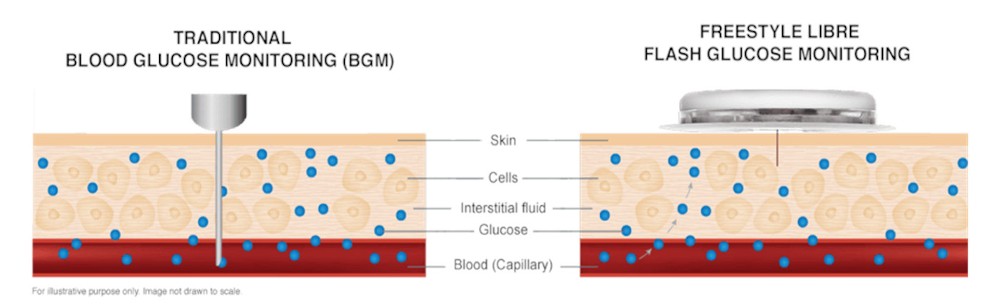

**This readme file have both English and Chinese versions，English version in first half and Chinese in second half.**

**该Readme文件含有英文和汉语双版本，英文版在前，中文版在后**
# calibration_algorithms_for_CGM

 An opensource calibration algorithms for CGM, all the algoritms are recreate from literatures(except for MLP).

### 1.What is CGM?

CGM is short for Continous Glucose Monitoring. It is a device to continous monitor the glucose level of body. Technically, there are many methods to complete the missions. In this project, we only focus on electrochemical method, which use a electrochemical probe inserted onto subcutaneous tissue to mesure the glucose(Fig. 1).

 

Fig. 1, left: the traditional BGM and CGM device

### 2.How does CGM work and what is the role of CGM algoritms?
The probe of CGM is inserted into subcutaneous and the enzyme catalyze the oxidation of the glucose and translate the glucose level into electrical current  

---
开源的CGM（动态血糖仪）算法，所有的算法均复现来自文献（除了MLP模型外）。
## 1.什么是动态血糖仪？
动态血糖仪，也成为持续型葡萄糖监控仪。理论上，可以有很多的方式实现持续的血糖监控。但在这里，仅关注电化学方法的实现。在该方法中，电化学探针被植入皮下，持续监控皮下组织的葡糖糖（图1）。

图1： 左，传统的血糖仪，穿刺到血管，直接提取血管样品；右，动态血糖仪，持续测量皮下组织液的葡萄糖
### 2. CGM的工作原理以及算法在其中的角色？

### 3. 现有的部分算法，其优缺点？

### 4. 项目内容的描述