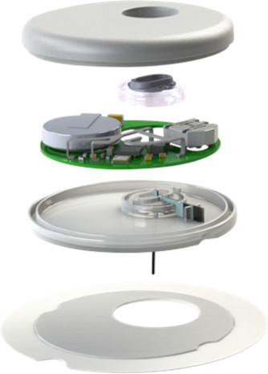
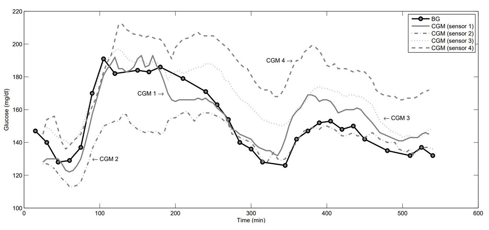

**This readme file have both English and Chinese versions，English version in first half and Chinese in second half.**

**该Readme文件含有英文和汉语双版本，英文版在前，中文版在后**
# calibration_algorithms_for_CGM

 An opensource calibration algorithms for CGM, all the algoritms are recreate from literatures(except for MLP).

### 1.What is CGM?

CGM is short for Continous Glucose Monitoring. It is a device to continous monitor the glucose level of body. Technically, there are many methods to complete the missions. In this project, we only focus on electrochemical method, which use a electrochemical probe inserted onto subcutaneous tissue to mesure the glucose(Fig. 1).

 

Fig. 1, left: the traditional BGM and CGM device

### 2.How does CGM work and what is the role of CGM algoritms?
The probe of CGM is inserted into subcutaneous and the enzyme catalyze the oxidation of the glucose and translate the glucose level into electrical current  

---
开源的CGM（动态血糖仪）算法，所有的算法均复现来自文献（除了MLP模型外）。
## 1.什么是动态血糖仪？
动态血糖仪，也称为持续型葡萄糖监控仪。该设备可以持续的监控人体葡萄糖，并记录其趋势，作为糖尿病管理的依据。理论上，可以有很多的方式实现持续的血糖监控。但在这里，仅关注电化学方法的实现。在该方法中，电化学探针被植入皮下，持续监控皮下组织的葡萄糖（图1）。

图1： 左，传统的血糖仪，穿刺到血管，直接提取血管样品；右，动态血糖仪，持续测量皮下组织液的葡萄糖
### 2. CGM的工作原理以及算法在其中的角色？
CGM的工作原理如下（图2）：

1. 探针被植入皮下组织后，探针上含有葡萄糖氧化酶（Glucose oxidase, GOx）,GOx可以催化葡萄糖的氧化，并通过电子传递过程，将电子传递至电极，形成电流；该电流与葡萄糖浓度是正相关关系（准线性关系）；
2. CGM设备上的电路板和芯片记录并处理该电流，最终以电信号的形式输出；
3. 电信号的强度与组织液中的葡萄糖浓度有正相关关系，需要通过算法（校准算法），逆推出组织液中的葡萄糖浓度，甚至可以逆推出血液中的葡萄糖浓度（注：组织中的葡萄糖浓度与血液中的葡萄糖浓度也是正相关关系）。

图2: CGM设备的分解结构

### 3. 现有的部分算法，其优缺点？
| 算法 | 代表文献| 优缺点|
| ----------- | ----------- | ----------- |
| 1. 两点或者多点的线性模型 | 无 | 该方法简便稳定，但未考虑到电化学探针可能的漂变，需要定期重新校准（除非CGM设备整体非常稳健，不然无法实现工厂校准）|
|2. 自回归模型| J Diabetes Sci Technol 2010;4(2):391-403 | 该方法假设某时刻的血糖浓度与前一段时间的血糖有相关关系（因为是与“自己的前值”相关，而非其他因素；所以称为自相关模型），该方法的稳定性不足，预测的血糖浓度漂变严重，需要定期用血糖数据校准| 
|3. 基于卡曼滤波器的模型 | The Extended Kalman Filter for Continuous Glucose Monitoring | 建立血糖、组织液葡萄糖以及其他参数的卡曼滤波器模型，输入用于校准血糖值后，算法可以结合测得的电信号，连续输出预测的血糖信号，但该模型的许多参数并不能直接从数据中习得，需要人为预估，随意性较大
|4. 考虑漂变的相关回归模型 | Glucose Monitoring Sensors: Bayesian Calibration Approach Applied to Next-Generation Dexcom Technology | 此类模型考虑了传感器的漂变，以及血糖和组织液葡萄糖的变化关系，稳健性较好，同时，如果只需设备具有较好的稳健性，即可实现工厂校准。

注：
工厂校准（Factory calibration）: 该概念区别于用户校准（User calibration），用户校准需要用户使用血糖仪，测量特定时刻的血糖数据，然后将该数据输入到CGM中，矫正CGM设备预测的偏差。工厂校准则不需要，其设备和算法具有良好的稳健性，CGM设备预测的偏差是可控的。用户校准需要用户不时地进行血糖测量，用户依从性较差，用户体验不佳，另外，血糖测量时，用户如操作不规范，测量值可能有较大的偏差，导致逆推出的葡萄糖浓度失真。下面介绍两篇文献，概略地阐述工厂校准：

文献1：Modeling the Glucose Sensor Error

文献2：Factory-Calibrated Continuous Glucose Sensors: The Science Behind the Technology

### 4. 项目内容的描述
Data文件夹：
measuredvalue.xlsx和measuredvalue.csv是原始的数据文件，只是格式不一样，里面共有79个病人的数据，有用的列包含：测量时间（measuredat），血糖值(blood)，CGM电信号值（ist）和病人识别号（segmentid）,每次测量的时间间隔为5min（有~20点的间隔大于5min，但考虑到间隔前后两点的数据变化值远小于正常间隔处的数据变化值，这些点依然被视为5min间隔，未作特别处理），